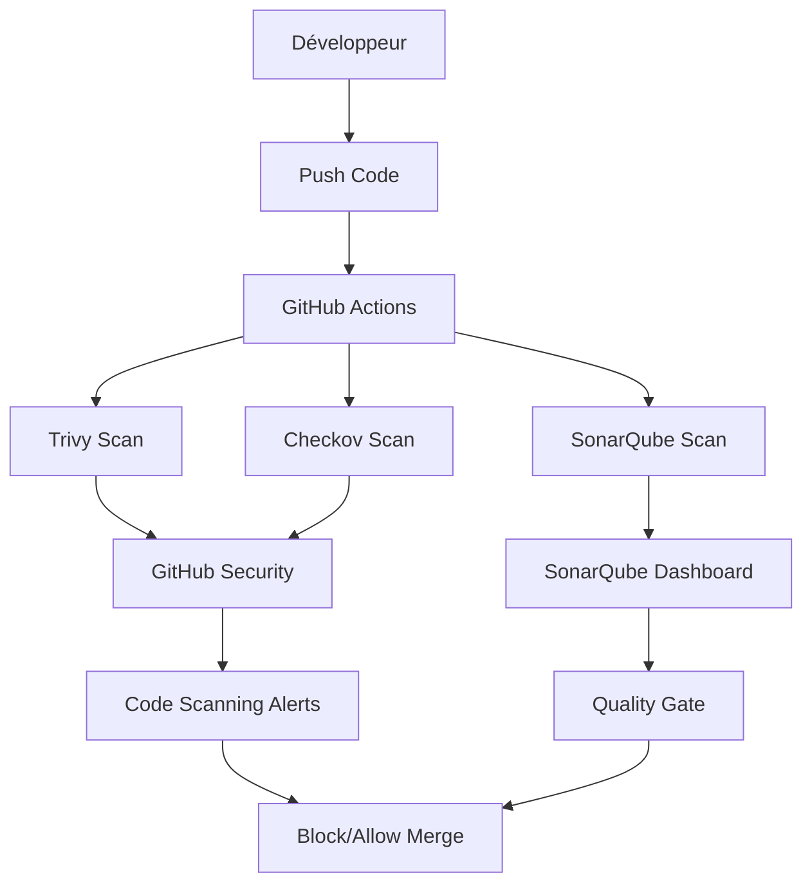

# Security Analysis Hub - DevSecOps Pipeline


## 📋 Table des Matières

- [Vue d'ensemble](#vue-densemble)
- [Architecture](#architecture)
- [Outils de Sécurité](#outils-de-sécurité)
- [Installation](#installation)
- [Configuration](#configuration)
- [Workflows CI/CD](#workflows-cicd)
- [Analyses de Sécurité](#analyses-de-sécurité)
- [Intégration IDE](#intégration-ide)
- [Résultats d'Analyse](#résultats-danalyse)
- [Bonnes Pratiques](#bonnes-pratiques)
- [Dépannage](#dépannage)
- [Contribution](#contribution)

## 🎯 Vue d'ensemble

Ce projet démontre l'implémentation d'un pipeline DevSecOps complet intégrant les principes de **Shift-Left Security**. Il centralise les analyses de sécurité de trois outils majeurs :

- **Trivy** - Scanner de vulnérabilités et secrets
- **Checkov** - Analyseur de configuration Infrastructure as Code (IaC)
- **SonarQube** - Plateforme d'analyse de qualité et sécurité du code

### 🎯 Objectifs

- ✅ Détecter les vulnérabilités dès le développement
- ✅ Automatiser les analyses de sécurité dans le CI/CD
- ✅ Centraliser les rapports de sécurité
- ✅ Intégrer la sécurité dans l'IDE des développeurs
- ✅ Bloquer les déploiements non conformes

## 🏗️ Architecture



## 🛡️ Outils de Sécurité

### Trivy
- **Type** : Scanner de vulnérabilités
- **Cibles** : Dépendances, secrets, images Docker
- **Format** : SARIF, JSON, Table
- **Intégration** : GitHub Code Scanning

### Checkov
- **Type** : Analyseur IaC
- **Cibles** : Terraform, CloudFormation, Kubernetes, Dockerfile
- **Format** : SARIF, CLI, JSON
- **Intégration** : GitHub Code Scanning

### SonarQube
- **Type** : Plateforme de qualité du code
- **Cibles** : Code source, tests, couverture
- **Format** : Dashboard Web
- **Intégration** : Quality Gates

## 🚀 Installation

### Prérequis

- Ubuntu/Debian VM ou environnement Linux
- Docker et Docker Compose
- Python 3.x avec pip
- Git
- Accès à GitHub avec permissions Actions

### Installation des Outils

#### 1. Docker

```bash
# Mise à jour du système
sudo apt update && sudo apt upgrade -y

# Installation des dépendances
sudo apt install ca-certificates curl gnupg lsb-release -y

# Ajout de la clé GPG Docker
sudo mkdir -p /etc/apt/keyrings
curl -fsSL https://download.docker.com/linux/ubuntu/gpg | sudo gpg --dearmor -o /etc/apt/keyrings/docker.gpg

# Ajout du dépôt Docker
echo "deb [arch=$(dpkg --print-architecture) signed-by=/etc/apt/keyrings/docker.gpg] https://download.docker.com/linux/ubuntu $(lsb_release -cs) stable" | sudo tee /etc/apt/sources.list.d/docker.list > /dev/null

# Installation Docker
sudo apt update
sudo apt install docker-ce docker-ce-cli containerd.io docker-compose-plugin -y

# Configuration utilisateur
sudo usermod -aG docker $USER
newgrp docker

# Vérification
docker run hello-world
```

#### 2. Trivy

```bash
# Installation Trivy
sudo apt-get install wget apt-transport-https gnupg -y
wget -qO - https://aquasecurity.github.io/trivy-repo/deb/public.key | sudo apt-key add -
echo deb https://aquasecurity.github.io/trivy-repo/deb stable main | sudo tee /etc/apt/sources.list.d/trivy.list
sudo apt-get update
sudo apt-get install trivy -y

# Vérification
trivy --version
```

#### 3. Checkov

```bash
# Installation Checkov
sudo apt install python3-pip -y
pip install checkov

# Vérification
checkov --version
```

#### 4. SonarQube

```bash
# Création des volumes Docker
docker volume create sonarqube_data
docker volume create sonarqube_extensions
docker volume create sonarqube_logs

# Lancement SonarQube
docker run -d --name sonarqube \
    -p 9000:9000 -p 9092:9092 \
    -v sonarqube_data:/opt/sonarqube/data \
    -v sonarqube_extensions:/opt/sonarqube/extensions \
    -v sonarqube_logs:/opt/sonarqube/logs \
    sonarqube:latest

# Vérification
docker ps
```

Accès SonarQube : `http://localhost:9000` (admin/admin)

## ⚙️ Configuration

### GitHub Secrets

Configurez les secrets suivants dans votre dépôt GitHub :

```
Settings > Secrets and variables > Actions > New repository secret
```

| Secret | Description | Exemple |
|--------|-------------|---------|
| `SONAR_TOKEN` | Token d'authentification SonarQube | `squ_xxxxxxxxxxxxx` |
| `SONAR_HOST_URL` | URL de votre instance SonarQube | `http://your-vm-ip:9000` |
| `SONAR_PROJECT_KEY` | Clé du projet SonarQube | `my-project-key` |

### Configuration SonarQube

1. Créer un nouveau projet dans SonarQube
2. Générer un User Token
3. Noter la Project Key
4. Configurer les Quality Gates si nécessaire

## 🔄 Workflows CI/CD

Les workflows sont automatiquement déclenchés sur :
- Push sur `main` et `develop`
- Pull Requests vers `main`

### Structure des Workflows

```
.github/workflows/
├── trivy.yml          # Scan vulnérabilités et secrets
├── checkov.yml        # Scan configurations IaC
└── sonarqube.yml      # Analyse qualité du code
```

## 🔍 Analyses de Sécurité

### Exemples de Résultats

#### Trivy - Vulnérabilités de Dépendances
```
supplygoat/package-lock.json (npm)
├── express
│   ├── CVE-2022-24999 (CRITICAL)
│   └── CVE-2022-24765 (HIGH)
├── minimist
│   └── CVE-2021-44949 (HIGH)
```

#### Checkov - Mauvaises Configurations IaC
```
Check: CKV_AWS_21: "Ensure all EC2 instances have an associated EC2 Key Pair"
        FAILED for resource: aws_instance.ec2_instance_no_keypair

Check: CKV_AWS_39: "Ensure S3 bucket is not publicly readable"
        FAILED for resource: aws_s3_bucket.public_bucket
```

#### SonarQube - Qualité du Code
- Code Smells détectés
- Vulnérabilités de sécurité
- Bugs potentiels
- Couverture de tests
- Duplication de code

## 💻 Intégration IDE

### Extensions VSCode Recommandées

| Extension | Description | Bénéfices |
|-----------|-------------|-----------|
| **SonarLint** | Linting en temps réel | Feedback immédiat sur la qualité |
| **Checkov** | Validation IaC | Détection des mauvaises configurations |
| **GitLens** | Amélioration Git | Traçabilité des modifications |
| **ESLint/Prettier** | Qualité du code | Formatage et bonnes pratiques |

### Configuration SonarLint

```json
{
  "sonarlint.connectedMode.project": {
    "connectionId": "my-sonarqube",
    "projectKey": "my-project-key"
  }
}
```

## 📊 Résultats d'Analyse

### Visualisation des Résultats

#### GitHub Security Tab
- **Code Scanning Alerts** : Résultats Trivy et Checkov
- **Dependency Alerts** : Vulnérabilités des dépendances
- **Secret Scanning** : Secrets détectés

#### SonarQube Dashboard
- **Overview** : Métriques globales du projet
- **Issues** : Bugs, vulnérabilités, code smells
- **Security Hotspots** : Points sensibles de sécurité
- **Coverage** : Couverture des tests

### Métriques de Sécurité

```
📈 Métriques Clés
├── Vulnérabilités critiques : 0
├── Vulnérabilités hautes : 2
├── Secrets exposés : 0
├── Configurations IaC non conformes : 5
└── Quality Gate : PASSED
```

## 🎯 Bonnes Pratiques

### Développement Sécurisé

1. **Shift-Left Security**
   - Intégrer les scans dès le développement
   - Utiliser les extensions IDE
   - Former les développeurs

2. **Gestion des Secrets**
   - Utiliser des gestionnaires de secrets
   - Ne jamais commiter de secrets
   - Rotation régulière des tokens

3. **Configuration IaC**
   - Principe du moindre privilège
   - Chiffrement des données
   - Audit des accès

4. **Qualité du Code**
   - Tests unitaires et d'intégration
   - Revues de code systématiques
   - Documentation du code

### Pipeline CI/CD

1. **Échec Rapide**
   - Bloquer les builds non conformes
   - Notifications immédiates
   - Feedback rapide aux développeurs

2. **Rapports Centralisés**
   - Format SARIF standardisé
   - Historique des analyses
   - Tableaux de bord unifiés

3. **Automatisation**
   - Scans automatiques
   - Mise à jour des dépendances
   - Déploiements conditionnels

## 🔧 Dépannage

### Problèmes Courants

#### Workflow GitHub Actions

```bash
# Vérifier les logs des workflows
# GitHub > Actions > Workflow run > Job details

# Problèmes de permissions SARIF
# Vérifier : Settings > Actions > General > Workflow permissions
```

#### SonarQube

```bash
# Vérifier le statut du conteneur
docker ps
docker logs sonarqube

# Redémarrer SonarQube
docker restart sonarqube
```

#### Trivy/Checkov

```bash
# Mise à jour des bases de données
trivy image --download-db-only
checkov --update
```

### Logs et Debugging

```bash
# Logs détaillés Trivy
trivy fs . --debug

# Logs détaillés Checkov
checkov -d . --log-level DEBUG

# Logs SonarScanner
sonar-scanner -X
```

## 🤝 Contribution

### Comment Contribuer

1. Fork le projet
2. Créer une branche feature (`git checkout -b feature/AmazingFeature`)
3. Commit les changements (`git commit -m 'Add AmazingFeature'`)
4. Push vers la branche (`git push origin feature/AmazingFeature`)
5. Ouvrir une Pull Request

### Standards de Code

- Suivre les conventions de nommage
- Ajouter des tests pour les nouvelles fonctionnalités
- Documenter les changements
- Respecter les Quality Gates SonarQube

## 📝 Licence

Ce projet est sous licence MIT. Voir le fichier `LICENSE` pour plus de détails.

## 📞 Support

- **Issues** : [GitHub Issues](https://github.com/your-org/security-analysis-hub/issues)
- **Documentation** : [Wiki](https://github.com/your-org/security-analysis-hub/wiki)
- **Discussions** : [GitHub Discussions](https://github.com/your-org/security-analysis-hub/discussions)

---

**Développé avec ❤️ par Nathan Piraux**